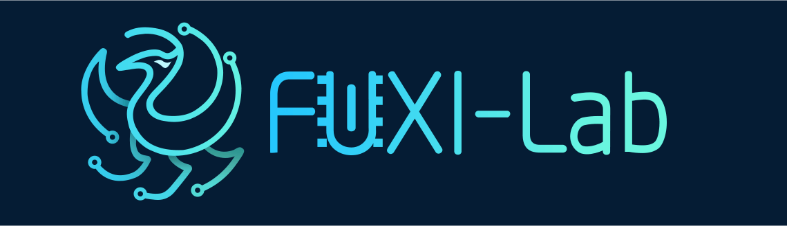
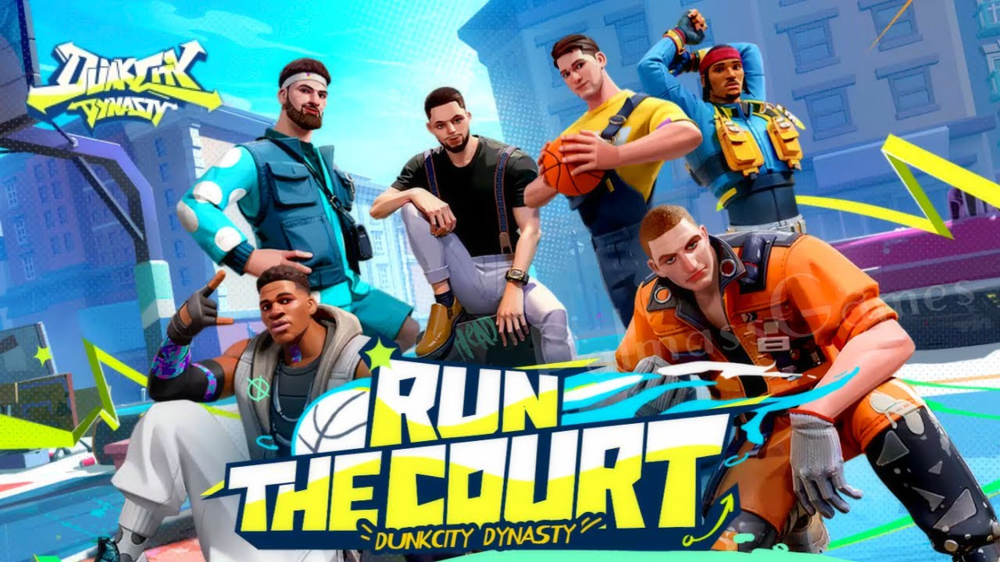

# Dunk City Dynasty: Asynchronous Multi-Agent Basketball Environment

This repository contains an RL environment based on a commercial online basketball game named [Dunk City Dynasty](https://www.dunkcitymobile.com/). It was created by the [Netease Leihuo Technology](https://leihuo.163.com/) and the [Netease FuXi AI lab](https://fuxi.163.com/) for research purposes.



## Content

- [Overview](#overview)
- [QuickStart](#quickStart)
- [Appendix](#appendix)

## Overview

Dunk City Dynasty is a brand new multiplayer online basketball game developed by NetEase Games. In the game, players can choose their favorite characters and participate in 3v3 street basketball matches. The player-controlled characters in the game are mostly star players from the National Basketball Association (NBA) in the United States, such as LeBron James, Kevin Durant, Stephen Curry, and so on, each with their own characteristics and exclusive skills. Players need to use their skills and strategies to win matches and improve their level and ranking. For more information about the game, please refer to the official website at https://www.dunkcitymobile.com/.

### Game Challenge

- **Asynchronous Decision-Making:**
- **Policy Generalization:**

### Observation Space

reference to [here](./assets/state.md)

### Action Space

reference to [here](./assets/action.md)

## QuickStart

### Installation

Everyone can install the Dunk City Dynasty Env via Github. First, download the repo via

```sh
git clone xxx.git
```

Then, to run the Dunk City Dynasty client, wine and several components are needed. We can install wine via the `install.sh` or using `docker`.

```sh
# install components in Ubuntu system
./install_deps.sh

# install components via docker
docker build -t dunk_city_dynasty_env:v1.0 .
```

Finally, install the relevant python packages. (Currently, we only support python=3.8)

```sh
conda create -n dunk_city_dynasty python=3.8
conda activate dunk_city_dynasty

pip install -r requirements.txt
```

### Get start

After installing the corresponding components, we can run the Dunk City Dynasty Env with the following python code.

```python
config = {
    'id': 1,
    'env_setting': 'win',
    'client_path': 'xxxxxxx',
    'rl_server_ip': '127.0.0.1',
    'rl_server_port': 6666,
    'game_server_ip': 'xxxxxxx',
    'game_server_port': 6667,
    'machine_server_ip': '',
    'machine_server_port': 0,
    'episode_horizon': 100000
    }

env = GymEnv(config)

states, infos = env.reset()
while True:
    action = {key: random.randint(0, 20) for key in states}
    states, rewards, dones, truncated, infos = env.step(action)
    print(action)
    if dones['__all__']:
        break
```

or, directly run the `get_start.py` file

```sh
# need to perform the relevant configuration in the get_start section first!!!
python get_start.py
```

### An easy training demo

```sh
xxx
```

## Appendix

- Client Path: 
- Human Data:

